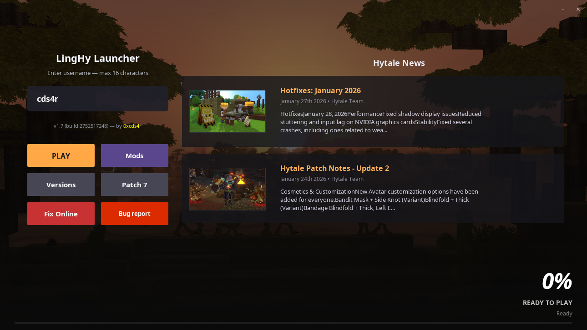
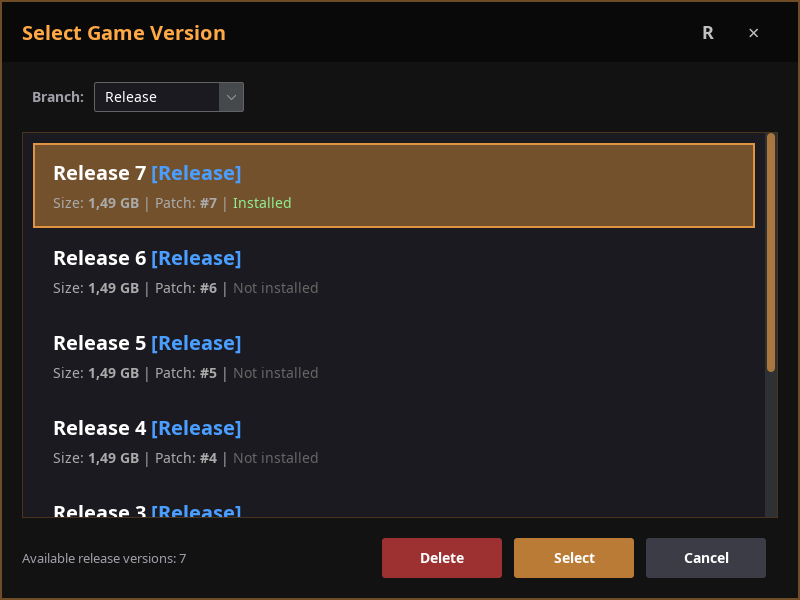
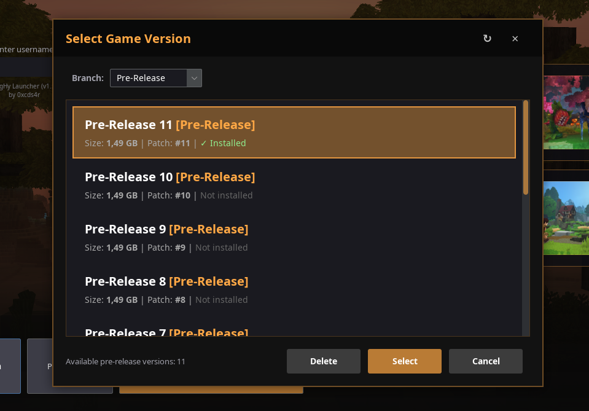
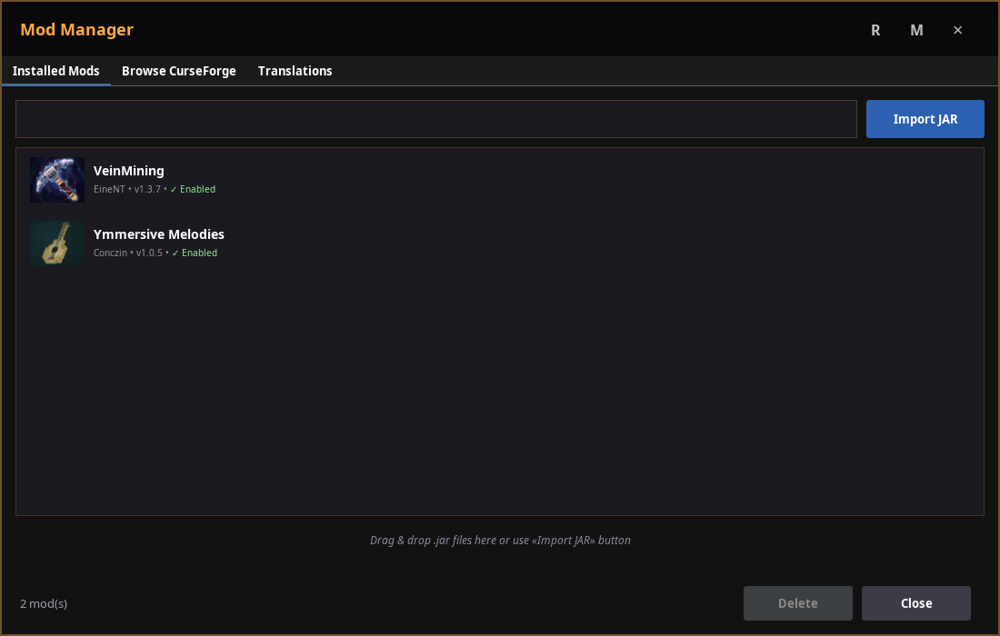
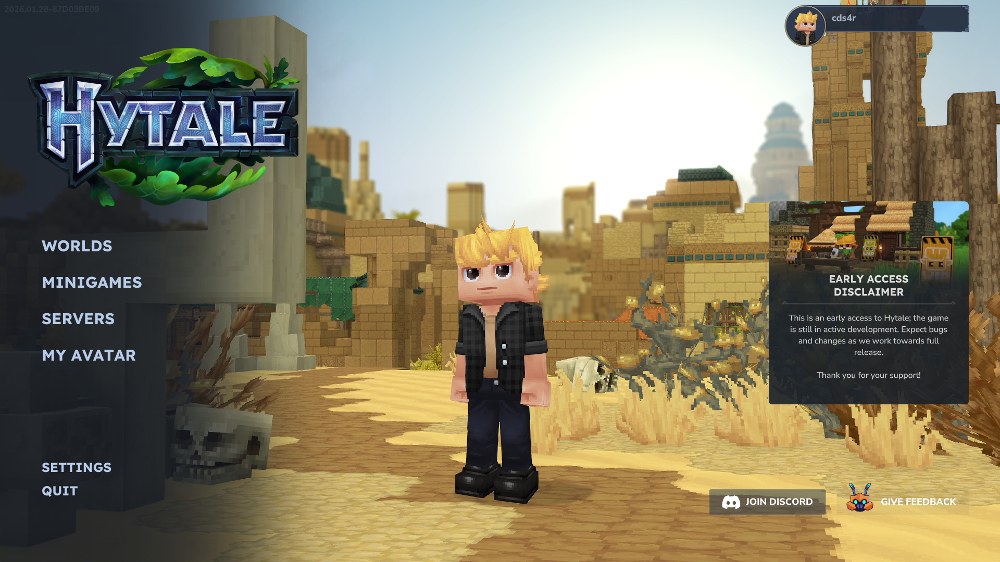

## LingHy Launcher for Hytale by 0xcds4r

### Download:

[Releases](https://github.com/0xcds4r/LingHy-Launcher/releases/tag/release)

### Change log:

v1.0:
- Installing and launching the basic version of the game
- Basic launcher interface with news
- Minor bugs

v1.2:
- Added version manager
- Added 'open game folder'
- News loop-loading bug-fix
- Optimize code

v1.4:
- Now we is LingHy Launcher :)
- Now is launcher main folder is '~/.hytale'
- Updated background
- Updated news section GUI
- Update version selector GUI
- Fixed news section scroll
- Added UUID generator
- Added folder selector for open (Game Files/UserData)
- Optimize code

v1.5:
- Added brach-support for pre-release versions (now you can pick them separately in the version manager)
- Version caching got a nice glow-up - loads way faster now
- Fixed that annoying long background load on launcher startup
- Launcher now minimizes (shrinks to taskbar) right after you hit Play - no more screen clutter
- Made the "Open Folder" button longer - easier to click, less rage
- In the folder picker, renamed the second button from "UserData" to "Mods/Saves" - way more clear what you're opening
- Added automatic process affinity to performance cores (P-cores) on startup  
  - Windows: SetProcessAffinityMask with mask 0xFFFF (first 16 logical threads)  
  - Linux: sched_setaffinity on first 16 cores  
  - Improves responsiveness and performance on hybrid CPUs (Intel Alder Lake / Raptor Lake and newer)
- Added automatic window autoscaling for the launcher
- Optimize code & bug fix

Note for v1.5: 

With the addition of pre-release / branch version support, the launcher folder structure has changed.

We strongly recommend clearing or renaming the old '~/.hytale/' folder to prevent conflicts with legacy data.

Before clearing, make a backup of your saves and mods.

v1.6:
- Added mod manager (BETA): installed mods and curse forge browse
- Optimize code & bug fix

v1.6.3:
- Added experimental Online Fix for linux, just click da button

v1.6.4:
- Hotfix: crash while running on Windows
- Added exe build for windows

v1.6.5:
- Added auto online-fix patcher for Windows (Experimental)

### Screenshots:

News & Control:

Hytale Latest Release Versions:

Hytale Latest Pre-Release Versions:

Mod manager:

Curse Forge support:

Easy to play for free:

